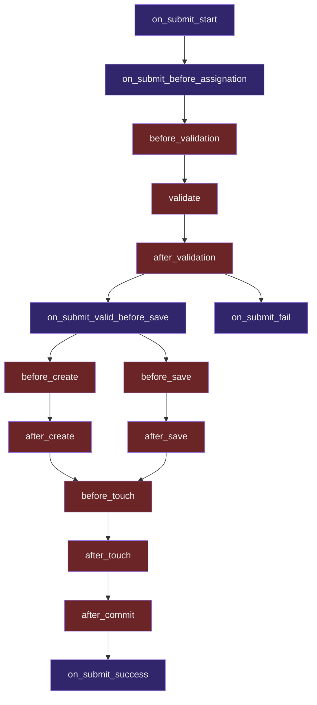

# Cycle de vie

Des méthodes sont mises à disposition pour intervenir dans les différentes étapes du cycle de vie de Query64. 



Exemple d'intervention après une soumission de formulaire réussi :  
```ruby
class Article < ApplicationRecord
  extend Submit64::MetadataProvider

  def self.submit64_lifecycle_events
    {
      on_submit_success: -> () { puts "well done!" }
    }
  end

end
```

Exemple d'intervention avant une soumission de formulaire valide, avec des arguments : 
```ruby
class Article < ApplicationRecord
  extend Submit64::MetadataProvider

  def self.submit64_lifecycle_events
    {
      on_submit_valid_before_save: -> (on_submit_data, context) { puts on_submit_data.resource_instance.label }
    }
  end

end
```

::: warning Important 
Consulter la [Définition API](/api-definition/models.md#submit64_lifecycle_events) pour connaître plus de détails.
:::
